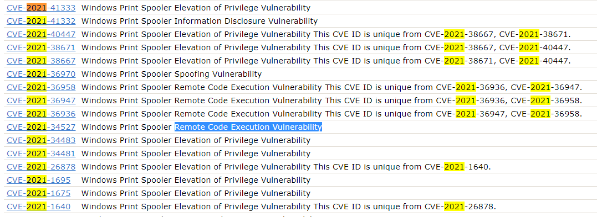

# CVE-XXXX-XXXX
Tags: Binary Exploitation
AUTHOR: MUBARAK MIKAIL

Description
Enter the CVE of the vulnerability as the flag with the correct flag format:
`picoCTF{CVE-XXXX-XXXXX}` replacing XXXX-XXXXX with the numbers for the matching vulnerability.
The CVE we're looking for is the first recorded remote code execution (RCE) vulnerability in 2021 in the Windows Print Spooler Service, which is available across desktop and server versions of Windows operating systems. The service is used to manage printers and print servers.

## Solution

In case you don't know, CVE stands for `Common Vulnerabilities and Exposures` and it's a website that stores cybersecurity vulnerabilities. More about it [here](https://www.cve.org/About/History). 

The link to search for keywords in the CVE website is [https://cve.mitre.org/cve/search_cve_list.html](https://cve.mitre.org/cve/search_cve_list.html). 

When I searched for [Windows Print Spooler Service](https://cve.mitre.org/cgi-bin/cvekey.cgi?keyword=Windows%20Print%20Spooler%20Service), it showed a lot of results, I filtered 2021 using `ctrl` + `F` and then I got 30 results. Just giving a brief look in the list, I found the **CVE-2021-34527**.

Now, I just prepared the flag
### **Flag:** `picoCTF{CVE-2021-34527}`

---
Daniel Reis - [@danielxreis](https://twitter.com/DanielXReis) - Developer and Cyber Security Researcher