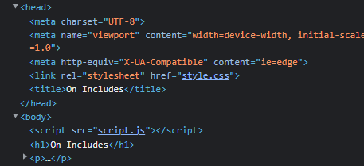

# Includes
Tags: Web Exploitation
AUTHOR: LT 'SYREAL' JONES

Description
Can you get the flag?
Go to this [website](http://saturn.picoctf.net:57833/) and see what you can discover.

## Solution

The link opens a page an fragment of a text from Wikipedia about Includes.  To solve this challenge we will need to take a look on the code of the page. 

In general, when a webpage is created, there's many files related to one page, the pages has commands to get the files and embed the, on the pages. We can search for them looking in the code of the page using the Developer Tools, available in all modern browsers.

In Google Chrome/Edge/Firefox, the shortcut key is `F12` or clicking with the right click of the mouse and selecting the option "Inspect Elements"

We can use this tool to test and change aspects of the website we are developing, we can spect the code, at least the code rendered in the client side. When requesting it to open, it will show  a window or sometimes it will split your current window, with the section of Developer Tools.

For this challenge, we only need the "Elements" tab, the first one that popups. This tab shows the the HTML page rendered in our browser. With the mouse and keyboard we can browse in the page and inspect the elements of the page. 

According to the challenge name and the text in the page, we must look for files that were included to this page.

I don't intend to detail all the html tags, but we can link every kind of file and to do it we must provide some attributes to the command, so we will look for the `href` or `src` attributes in the page code.

With that in mind, we can easliy spot the `style.css` and `script.js`. See that these excerpts have an underline on, so clicking in them with the right click of the mosue, we can request the browser to reveal it origins panel or open it in a new tab.

After that, we will be able to see the first half of the flag in `style.css` and second half in the `script.js`. 

### **Flag:** `picoCTF{1nclu51v17y_1of2_f7w_2of2_b8f4b022}`

---
Daniel Reis - [@danielxreis](https://twitter.com/DanielXReis) - Developer and Cyber Security Researcher