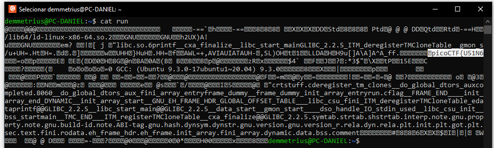
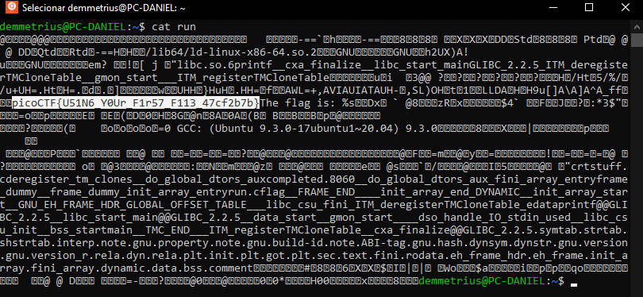

# file-run1
Tags: Reverse Engeneering
AUTHOR: WILL HONG

Description
A program has been provided to you, what happens if you try to run it on the command line?
Download the program [here](run).

## Solution

In general, before we run anything in our system, we should check what is the content of a executable. Since this challenge is related to "Reverse Engeneering", I belive using `cat` or `head` commands or even opening the file in a text editor would be more prudent than just executing it without at least give a glance in the file's output.

Just opening the [run](run) with text editor and searching for "flag" was enough to find it. But, getting into more detailed answer:

The `cat` command is used to concatenate files and **print the output**, is very used to **print output the contents of a file without executing it**. The head command is very similar, but this one only show the begining of the files.

In linux, just typing `cat run` it gave  the start of the flag.

It happend just because of the size of the window runing the terminal. Just resizing the window and typing the command again returned the flag.

I know there is "no right way" to get the flags, But reading the hints of the challenge, they suggest to use command line commands.

So, first, in Linux, we must give rights to execute a file. We do this using the command `chmod`,  used to change the file mode, with the argument `+x`, to make the file executable.

`chmod +x run`

After that, just type `./` the name of file to run it. 

`./run`

It will return 

`The flag is: picoCTF{U51N6_Y0Ur_F1r57_F113_47cf2b7b}`

### **Flag:** `picoCTF{U51N6_Y0Ur_F1r57_F113_47cf2b7b}`

---
Daniel Reis - [@danielxreis](https://twitter.com/DanielXReis) - Developer and Cyber Security Researcher